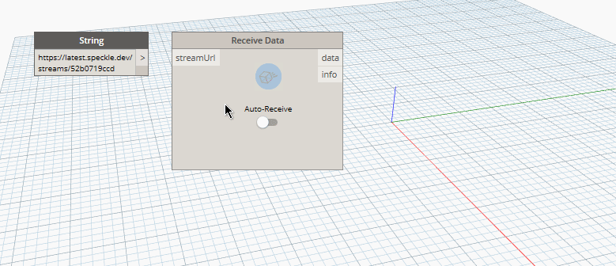
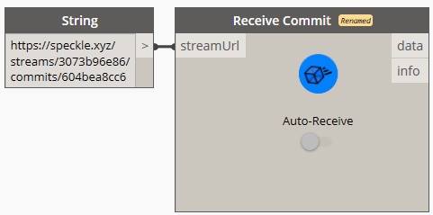
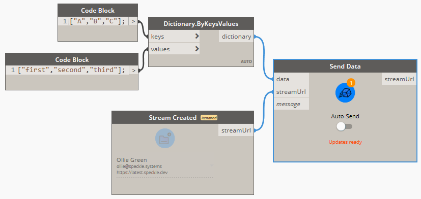
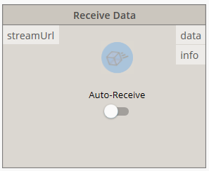
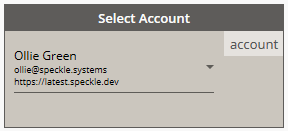
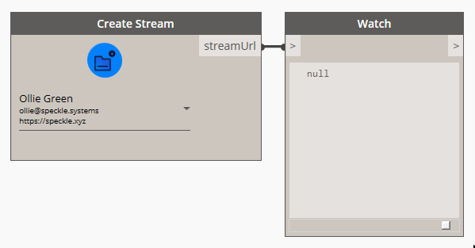
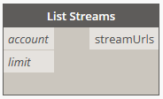
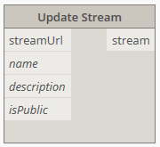

# Dynamo

Speckle's Dynamo connector currently supports Dynamo versions 2.1 to 2.10 (for Autodesk Revit 2019-2022). All versions of Dynamo Sandbox from 2.1 to 2.10 are also supported.

## Getting Started

Our Dynamo Connector takes the form of a node package, which is installed via the Speckle Manager. Please Note: The Speckle package cannot be downloaded from Autodesk's Package Manager. To install the Dynamo Connector and add your Speckle account, follow the instructions in our [Speckle Manager](/user/manager) section.

Once installed, the **Dynamo Connector** will appear as a node package in your library as `Speckle 2`.

The `Speckle 2` package contains the main nodes necessary to use Speckle within Dynamo, including nodes for sending and receiving data, managing streams and selecting accounts. We've also built a few nodes for more advanced use-cases, as well as some handy tools for Speckle developers/hackers. These are found in the `Developer Tools` sub-section of the package. 

## Streams and URLs

In Dynamo, Speckle Streams are identified by their URLs.
Across our Dynamo and Grasshopper connectors you'll see URLs in 3 different formats:

- `https://speckle.xyz/streams/3073b96e86` points to the `main` branch on Stream `3073b96e86`
- `https://speckle.xyz/streams/3073b96e86/branches/dev` points to a branch named `dev` on Stream `3073b96e86`
- `https://speckle.xyz/streams/3073b96e86/commits/604bea8cc6` points to a specific commit `604bea8cc6` on Stream `3073b96e86`
- `https://speckle.xyz/streams/3073b96e86/objects/df7b8bafccefa791d82939dd36541189` points to a specific object `df7b8bafccefa791d82939dd36541189` on Stream `3073b96e86`

::: tip
Unsure about what _commits_ and _branches_ are? No worries, you don't need to know what they are to use Speckle! But if you're curious, you can read about them in [Core Concepts](/user/concepts).
:::

We'll see how branch and commit URLs are used in the following sections.

## Sending Data

Let's look at how we would send some data in Dynamo. First, start by creating a new `Send Data` node.

In order to select which stream to send data to, you just need to pass a stream URL to the `streamUrl` port.

Alternatively, you can also use one of the following nodes to create / retrieve existing streams:

- [Create Stream](user/dynamo.md#create-stream)
- [Get Stream](user/dynamo.md#get-stream)
- [List Streams](user/dynamo.md#list-streams)

:::tip NOTE
You cannot send data to a specific commit. Commits are a snapshot of data at a specific point in time and therefore cannot be edited.
:::

### Adding Objects

In order to select which objects to should be sent to your stream, you just need to connect the desired data to the `data` input in the `Send Data` node. The node will automatically convert any supported Dynamo objects into a Speckle-compatible format.

### Adding a Commit Message

Although optional, it's considered good practice to add a "commit message" whenever you send you data (especially if working with others). This message should describe the changes being pushed. You can add a commit message by passing any string to the `message` port.
The commit message will be visible in the Speckle Web App (where you will also be able to edit it).

### Sending Data

With a Stream URL and some data to send, the only thing left to do is to press the **Send button**. This will begin the process of translating your data to Speckle's object model and uploading it to your Speckle server.

### Viewing a Stream Online

To view the sent stream online you can just right click on the sender node:

### Sending to a Specific Branch

When using a stream URL, by default, the `main` branch is used to send and receive data.

To send to a specific branch, simply use the branch URL, such as: `https://speckle.xyz/streams/3073b96e86/branches/dev`.

## Receiving Data

Receiving data is very simple, you just need a `Receive Data` node, and a stream URL.

When new data is pushed to this stream a notification will appear on the receive node.

### Auto Receiving

By using the toggle on the node, you can enable/disable auto receiving. If enabled, new data pushed to this stream will be pulled automatically as it's available.

### Receiving a Specific Branch

When using a stream URL, the `main` branch is used to send and receive data by default.

You can also receive data from a specific branch; simply use the branch URL, such as: `https://speckle.xyz/streams/3073b96e86/branches/dev`.

### Receiving a Specific Commit

We've already seen how to retrieve data from streams and branches. It's possible to go even deeper, retrieving data from specific commits. To do this, simply use the commit URL, such as: `https://speckle.xyz/streams/3073b96e86/commits/604bea8cc6`

::: tip NOTE

When receiving from a commit, the node will stop showing notifications about new activity and the auto-receive toggle will be disabled. This is because commits cannot be edited.

:::

### Receiving a Specific Object

Similarly to commits, you can also point the receive node to a specific object. To do this, simply use the object's URL, such as: `https://speckle.xyz/streams/3073b96e86/objects/df7b8bafccefa791d82939dd36541189`.

Like commits, objects in a commit cannot be edited, so the data received using such a URL will always be consistent. You can find the ID of an object from the Speckle Web interface:

### Viewing a Stream Online

To view the received stream online you can just right-click on the receiver node:

## Creating Custom Objects

A `Custom Object` is a [Base Object](/user/concepts.html#the-base-object) with custom properties assigned to it. It's basically a custom data structure you can create to send data in a specific format that you define.

In Dynamo, we use dictionaries to represent custom objects since they are natively supported, so creating custom objects is as simple as creating a dictionary containing the keys and values you wish to include in the `Base` object.

This dictionary will be automatically converted to a `Base` object during the _Send_ operation.

::: tip
Learn more about the Speckle `Base` object [here](/user/concepts.md#the-base-object) 👈
:::

## All Speckle Nodes

### Send Data

The **Send Data** node performs sending operations. Data is usually sent to a Speckle Server, but the node also supports sending to a different data storage using _transports_. Whenever possible, the _Send_ node will try to convert any compatible objects into Speckle format.

There is also an switch you can toggle to enable the node to send automatically the data whenever it changes.

#### Input

- _data_: This port will accept almost anything you give it! If the objects provided are not `Base` objects, it will also perform the conversion to Speckle automatically.
- _streamUrl_: Supports any generated stream from within the `Stream` component category, but also _stream urls_ in text format.
- _message (optional)_: The message you want to attach to the _commit_ when you send the data. Defaults to `"Dynamo push"`.

#### Output

- _streamUrl_: The _commit url_ pointing to the objects in the Speckle server.

### Receive Data

The **Receive Data** node fetches data from a specified `Stream` or any other valid `Transport`. Whenever possible, the receiver node will try to convert all Speckle objects into compatible objects.

#### Inputs

- _streamUrl_: The URL of any Speckle stream, branch, commit or object.

#### Outputs

- _data_: Any data that was received from the stream.

### Send Local Data

The **Send Local Data** node performs sending operations directly to the users's local database.

#### Inputs

- _data_: The data to be sent locally. This port will accept almost anything you give it. If the objects provided are not `Base` objects, it will also perform the conversion to Speckle automatically.

#### Outputs

- _localDataId_: The unique `id` for the data that was locally sent.

### Receive Local Data

The **Receive Local Data** node performs receive operations in the same way as the [Receive Data](#receive-node) node, the only difference is that data is received locally from the Speckle's user local database, instead of the server or any other transport.

#### Inputs

- _localDataId_: The unique `id` for the data you want to fetch locally. This would be provided from a [Send Local Data](#local-send-node) node.

#### Outputs

- _Data_: The data thas was received. This port will accept almost anything you give it. If the objects provided are not `Base` objects, it will also perform the conversion to Speckle automatically.

### Select Account

The **Select Account** node provides a fast way of selecting different Speckle accounts.

> Accounts must be set-up in your computer using the **Speckle Manager**.

### Create Stream

To create a new stream, right-click on the canvas and search for the `Create Stream` node. This node has a custom UI that allows you to select a specific account to use, and a button to confirm the stream creation.

::: tip
You can also create streams online form Speckle Web. From there you can also set their name, description and permissions.
:::

Once created, the node will remember that stream. Meaning you will not be able to _change_ the stream you created, or create a new one using the same node (to do this, just create a new `Stream Create` node).

Select the appropriate account and press the blue button. If the stream creation was successful, the output of the node should be a _stream url_ pointing to the newly created stream and linked to the specified account.

#### Viewing the Stream online

To view the newly-created stream online you can just right click on the node:

#### Inputs

> This node has no inputs.

#### Ouputs

- _streamUrl_: A URL, pointing to the newly-created stream.

### Get Stream

The **Get Stream** node will try to retrieve an existing `Stream`, given its URL and a specific account to access that stream with. This may be useful if there are multiple accounts registered on the same machine and a certain stream requires a specific account to be accessible.

#### Inputs

- _streamUrl_: The URL of any Speckle stream, branch, commit or object.
- _account (optional)_: A Speckle account, provided by the **Accounts node**. If no account is provided, the _default account_ will be used.

#### Outputs

- _stream_: A `Stream` object pointing to existing stream. If the stream doesn't exist, an error will be shown.

### List Streams

The **List Streams** node returns a specified amount of streams available in an account. For performance reasons, it has been limited to fetching a maximum of 20 streams.

#### Inputs

- _account (optional)_: A Speckle account, provided by the **Accounts node**. If no account is provided, the _default account_ will be used.
- _limit (optional)_: The number of streams to fetch from the server.

#### Outputs

- _streams_: List of `Stream` objects available to the specified account.

### Stream Details

The **Stream Details** node returns all relevant information related to a specific `Stream`.

#### Inputs

- _stream_: Supports any generated stream from within the `Stream` component category, but also _stream urls_ in text format.

#### Output

- _stream_: The unique `id` that identifies the stream.
- _name_: The name of the stream.
- _description_: The description of the stream.
- _createdAt_: The date this stream was created.
- _updatedAt_: The date marking the last time the stream was updated.
- _public_: Boolean value indicating if the stream is public or private.
- _collaborators_: A list of collaborators that have access to this stream, as well as their roles.
- _branches_: A list of available branches for this stream.

### Update Stream

The **Update Stream** node allows for updating a stream's _name_, its _description_ and whether it is _public_ (publicly available to read by anyone with the _stream url_) or _private_ (only invited collaborators can view this stream).

#### Inputs

- _streamUrl_: The URL of a stream, branch, commit or object.
- _name (optional)_: Text string with the new name for the stream.
- _description (optional)_: Text string with the new description for the stream.
- _isPublic (optional)_: Boolean value to activate/deactivate this stream's _link sharing_.

#### Output

- _streamUrl_: The URL of the updated stream.

### Developer Tools

These nodes were developed exclusively for testing/development purposes. If you don't know what these are, you most likely won't ever need them.

#### Convert to Speckle

The **Convert to Speckle** node will convert any supported objects (such as lines, curves, meshes...) into Speckle ones.

This node was developed for testing/development purposes, as the Send/Receive nodes will already perform this conversion step automatically.

#### Convert to Native

The **Convert to Native** node will convert any supported Speckle objects into compatible objects.

This node was developed for testing/development purposes.

#### Serialize to JSON

The **Serialize to JSON** node will convert any Speckle object into `JSON` formatted text.

#### Deserialize from JSON

The **Deserialize from JSON** node will convert a serialized Speckle object in `JSON` format into `Base` Speckle objects.

#### Server Transport

Creates a connection to a specific Speckle Server.

#### SQLite Transport

Creates a connection to a specific SQLite database.

#### Disk Transport

Creates a connection to a specific file in the computer's disk, where the data will be saved in JSON format.

#### Memory Transport

Creates a connection to in-memory storage.

## Supported Elements

| Geometry       | Send          | Receive       | Status     |
| -------------- | :-----------: | :-----------: | :--------: |
| Point          | ✅             | ✅             | `Complete` |
| Line           | ✅             | ✅             | `Complete` |
| Plane          | ✅             | ✅             | `Complete` |
| Arc            | ✅             | ✅             | `Complete` |
| Circle         | ✅             | ✅             | `Complete` |
| Cuboid         | As Box        | ✅             | `Complete` |
| Ellipse        | ✅             | ✅             | `Complete` |
| Helix          | As Spline     |               | `Complete` |
| Polyline       |               | xα | `Complete` |
| Polycurve      | ✅             | ✅             | `Complete` |
| Polygon        | As Polyline   | ✅             | `Complete` |
| Rectangle      | As Polyline   | ✅             | `Complete` |
| Spline         | ✅             | ✅             | `Complete` |
| Brep           | ✅             | ✅             | `Complete` |
| Mesh           | ✅             | ✅             | `Complete` |
| Revit Elements | xβ |               | `Complete` |

α: As Rectangle, Polycurve, or Polygon

β: All Revit elements described [here](/user/revit.html#supported-elements) can also be sent from Dynamo

### Unsupported Elements

Any geometric element not listed above are not supported.
