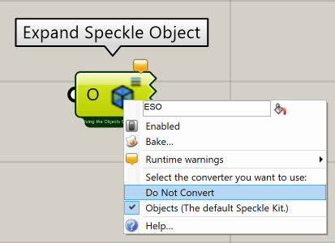
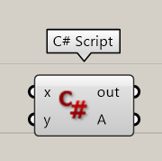
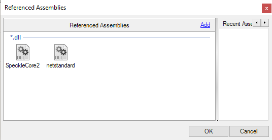
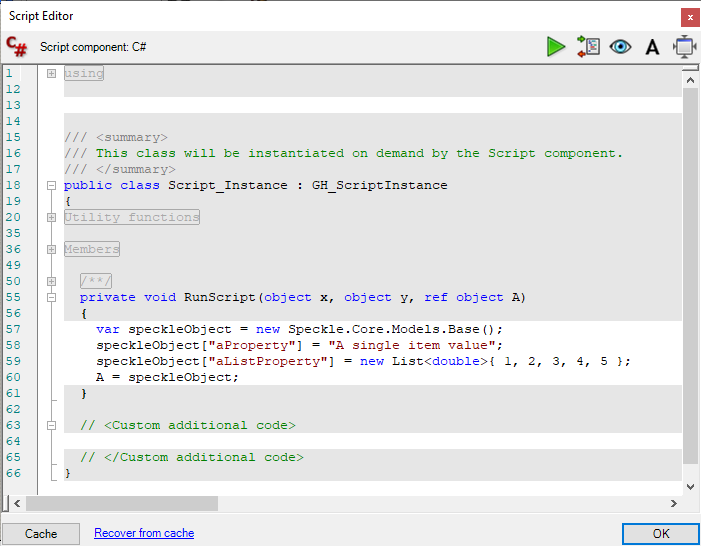
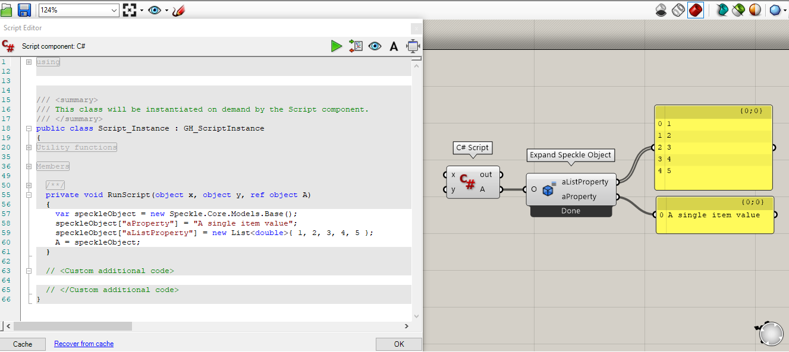
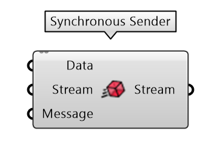
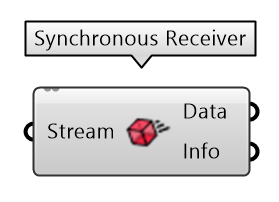
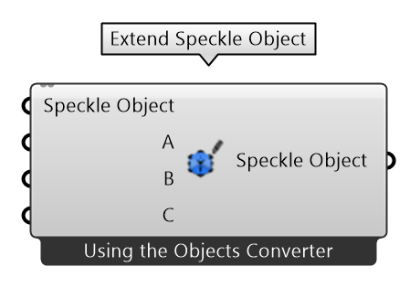

# Grasshopper

## Getting Started

Speckle currently supports Grasshopper for McNeel Rhino 6 and 7.
To install this Connector and connect your Speckle account, make sure to follow the instructions in [Speckle Manager](/user/manager).


Once installed, the **Grasshopper Connector** will appear under the `Speckle 2` tab, or if you use _tab icons_ you'll see our new Speckle logo instead.

The following component categories are intended for all users:

- Send/Receive nodes
- Account category, holding all account related nodes.
- Stream category, holding all stream related nodes.

We've also built a few components designed for advanced users and developers:

- Dev/Conversion: Conversion + serialization nodes.
- Dev/Transports: Not sure what transports are? Check [this](/dev/transports.md) out!

## Streams and URLs

In visual programming environments, Speckle Streams are identified by their URLs. Across our Dynamo and Grasshopper connectors you'll see URLs in 4 different formats:

- `https://speckle.xyz/streams/3073b96e86` points to the `main` branch on Stream `3073b96e86`
- `https://speckle.xyz/streams/3073b96e86/branches/dev` points to a branch named `dev` on Stream `3073b96e86`
- `https://speckle.xyz/streams/3073b96e86/commits/604bea8cc6` points to a specific commit `604bea8cc6` on Stream `3073b96e86`
- `https://speckle.xyz/streams/3073b96e86/globals/d227da61c1` points to the [globals](/user/web.html#globals) at `d227da61c1` on Stream `3073b96e86` (the globals id is optional)

::: tip
Unsure what _commits_ and _branches_ are? 🤔

No worries, you don't need to know what they are to use Speckle! But if you're curious, you can read about them in [concepts](/user/concepts).
:::

We'll see how branch and commit URLs are used in the following sections.

## Sending Data

Let's look at how we would send some data in grasshopper. First, start by creating a new `Send` node.


To select the stream you want send data to,just pass in its URL as a string to the stream port.


Alternatively, you can also use one of the following nodes to create or retrieve existing streams:

- [Create Stream](user/grasshopper.md#create-stream)
- [Get Stream](user/grasshopper.md#get-stream)
- [List Streams](user/grasshopper.md#list-streams)

:::tip NOTE
While you can send data to streams and branches, you cannot send data to a specific commit. This is because commits represent your stream in a specific point in time. Therefore, everything that gets sent to Speckle is already a commit.

Want to edit an old commit? Just re-send the data and use the new commit instead.
:::

#### Adding Objects

In order to select which objects to send in grasshopper, we just need to connect the desired nodes to the `Data` input in the `Send` node. The sender supports any type of data, in any structure (item, list, datatree), and will convert any supported Rhino objects into a Speckle-compatible format where necessary.

#### Adding a Commit Message

While not required, it's good practice to add a "commit message" whenever you send you data, especially if working with others. This message should briefly describe the changes being pushed.
You can add a commit message by passing some text to the `message` port.
The commit message will be visible in Speckle Web (where you will also be able to edit it).

#### Sending

Once you've lined up your objects (and optionally written a commit message) the only thing left to do is to press the **Send button**.


::: tip
To view the data you just sent in Grasshopper, right-click the `Send` node and select the `View commit ...` option. This should open a new browser window loading the _stream url_. You can share that url with any collaborators so they can receive the data.


:::

### Sending to a Specific Branch

When referring to a stream by its URL, the `main` branch is used to send and receive data by default.

To target a specific branch, simply use the branch URL, such as: `https://speckle.xyz/streams/3073b96e86/branches/dev`.

## Receiving Data

Receiving data is very simple. You just need a `Receive` node, and a stream URL.


When new data is pushed to this stream a notification will appear on the receive node, highlighting this fact.

### Auto Receiving

By right-clicking on the node, you can enable/disable auto receiving. If enabled, new data pushed to this stream will be pulled automatically as it becomes available.


### Receiving a Specific Branch

When referring to a stream by its URL, the `main` branch is used to send and receive data by default.

To receive from a specific branch, simply use the branch URL, such as: `https://speckle.xyz/streams/3073b96e86/branches/dev`.

### Receiving a Specific Commit

As we've seen, you can retrieve data from both the 'stream' and 'branch' level. It goes deeper - it's possible to retrieve data from specific commits. To do so, simply use the commit URL, such as: `https://speckle.xyz/streams/3073b96e86/commits/604bea8cc6`

::: tip NOTE

When receiving from a commit, the node will stop showing notifications about new activity on such stream and the auto receive toggle will be disabled.

:::

### Receiving a Specific Object

Finally, you can also receive just a specific object in a commit, to do so simply use the commit URL, ie: `https://speckle.xyz/streams/3073b96e86/objects/df7b8bafccefa791d82939dd36541189`. Objects can't be edited, so the data received using such a URL will always be consistent.
You can find the ID of an object from the Speckle Web interface:


## Creating Custom Objects

A custom object is a [Base Object](/user/concepts.html#the-base-object) with custom properties assigned to it. It's basically a custom data structure you can create to send data in a specific format that you define.

There's several different ways to create custom speckle objects using the Grasshopper. One of them is using the `Create Speckle Object` node.


This node is a _variable parameter_ type, meaning if you zoom into the _inputs_ section, you should see a `+/-` sign that will allow you to add/remove properties from the object. Each input you define will represent a new property on the object. You can also modify the name of these properties, as well as their _access type_.

<!-- > This node is capable of [Kit Selection](#object-conversion-and-kits) -->

#### Modifying the Access Type

Access type operates in the same way as the `Python` and `C#` script components. In this case, you can specify if you want a specific property in the object to be a _list_ or a single _item_.


::: warning
Choosing the wrong access type for your data may result in duplicated data being generated.
:::

#### Detach/Do Not Detach

Every property can also be specified as _detached/non-detached_. When a property is _detached_, it means that the objects it contains will be saved as independent entities in the Speckle database. All properties are detached by default for performance reasons, but you can choose not to by specifying `Do not detach` on the right-click menu.


#### Optional

Every property can also be flagged as _optional_. This will allow you to create new objects with _incomplete_ data.

Please Note: There is a limitation on this behaviour. At least one of the node's inputs must be _non-optional_.


::: tip

When you activate any of the previous options, the corresponding icon will be shown in the parameter, very much like the `Graft/Flatten/Simplify` options.


:::

## Supported Elements

- [Grasshopper Support Tables](/user/support-tables.html#grasshopper)

## Schema Builder


The **Schema Builder** node is a very powerful one. It works similarly to the node above as it allows to create custom objects, but it does so by following pre-existing schemas. To learn more about [schemas and kits](/dev/kits) check out or dev section.

By default, the Schema Builder node comes with a series of types, these include mainly building elements to enhance interoperability between Rhino/Grasshopper and other BIM software solutions like Revit.

When a new **Schema Builder** node is created, a pop-up window will be displayed prompting the user to select a specific object schema. This schema will be used to populate the input/output ports of the node with the appropriate fields.


::: tip
Check out our [tutorial on sending data from Grasshopper to Revit](/user/interop-gh-revit)!
:::

## Object Conversion

By default, the Speckle nodes will try to convert any compatible objects (such as meshes, solids, lines and points):

- **On Input**: to Speckle compatible format.
- **On Output**: to the native Rhino format that Grasshopper will understand.

There are some situations where this behavior may not be ideal, as it may cause unintentional data-loss. This is particularly true when dealing with nested data.

Speckle can handle nested Speckle objects without any issues but, due to limitations in the Rhino API, you can only attach text to a specific geometry object's custom data, such as a line.


Since any valid geometry objects will be automatically converted to their Rhino representation when they're output by a node, this _non-supported_ data will be _"lost"_.

In order to provide a work-around to this problem, all nodes that perform conversions have an "Do not convert" option in the right-click menu, that will prevent conversion from occurring on that specific node.



::: details Handling geometry objects with nested data

Following the example above, we package and send the custom Speckle Line.


After receiving the data, when expanding Speckle objects you'll have several options:

1. Default behavior when receiving data: Automatic conversion to Rhino objects
   
2. Behavior when "Do not convert" options is enabled: Output is a Speckle Line
   

Now you can access the custom data attached to the line:


:::

::: tip
Don't worry, we always ensure all objects are converted to Speckle format before preforming a `Send` operation.
:::

## Using the C#/Python script nodes

For more advanced scenarios, you can also use the Speckle libraries inside your custom C# or Python scripts in any Grasshopper definition. There is, though, a bit of a set up involved for this to properly work.

::: tip Fair warning

About creating your own objects in scripting nodes: Creating objects with [`circular references`](https://en.wikipedia.org/wiki/Circular_reference) is **not supported**, and although there is nothing stopping you from creating this types of object relationships in your code, they will fail to be sent to the server (or any other transport for that matter).

That said, they **will work** inside your Grasshopper definition, but we heavily suggest you don't. If you end up doing so (for whatever reason we don't want to know... 😉), just make sure you remove all those nasty `circular references` before sending.

:::

### C# Script

1. Create a new C# node on your canvas.

   

2. Right-click the node and select `Manage assemblies...` from the dropdown menu.

   

3. A new window will appear. Press the `Add` link to select a new library. You'll need to add **two libraries**:
   1. Find the location of the Speckle Grasshopper connector. It should be in the same library as all your other 3rd party plugins (usually `%appdata%\Grasshopper\Libraries\SpeckleGrasshopper2`) and select `SpeckleCore2.dll`.
   2. Now head to `C:\Windows\Microsoft.NET\assembly\GAC_MSIL\netstandard\v4.0_2.0.0.0__cc7b13ffcd2ddd51` and select `netstandard.dll`
4. Once done, it should look like this:

   

5. Now open up your script and add the following lines of code:

   ```csharp
   var speckleObject = new Speckle.Core.Models.Base();
   speckleObject["aProperty"] = "A property value";
   speckleObject["aListProperty"] = new List<double>{ 1, 2, 3, 4, 5 };
   A = speckleObject;
   ```

   

6. This will output a `Base` object, to see the properties inside it you can always use `Expand Speckle Node`

   

### Python Script

The process to use Speckle in a python script is similar to the C# node steps, only this time, we'll reference the assemblies directly in our code using `clr`.

1. Add a new python node to your canvas
2. Double click it to open the editor, and paste this code to reference the libraries (remember to replace `USERNAME` for the actual name in your computer)

   ```python
    import clr
   clr.AddReferenceToFileAndPath("C:\\Windows\\Microsoft.NET\\assembly\\GAC_MSIL\\netstandard\\v4.0_2.0.0.0__cc7b13ffcd2ddd51\\netstandard.dll")
   clr.AddReferenceToFileAndPath("C:\\Users\\USERNAME\\AppData\\Roaming\\Grasshopper\\Libraries\\SpeckleGrasshopper2\\SpeckleCore2.dll")
   import Speckle.Core.Models.Base as Base
   ```

3. Bellow that, add this code to create a new Speckle object.

   ```python
   speckleObject = Base()
   speckleObject["aProperty"] = "A single item value"
   speckleObject["aListProperty"] = [ 1, 2, 3, 4, 5 ]
   a = speckleObject
   ```

4. Your final result should look like this:
   

5. And that's it! The output will be a `Base` object you can operate with just like any other created with the `Object Management` nodes.

## Nodes

### Send Node


The **Send Node** performs sending operations, usually to a Speckle Server, but also supports sending to a different data storage using _transports_. Whenever possible, the _Send_ node wil try to convert any Rhino-compatible objects into Speckle format.

There is also an option to set the node to automatically send every time there is a change in the data. You will find this option in the right-click menu of the node.

|  |  |
| ---------------------------------------------------------------------------- | --------------------------------------------------------------------------- |


<!-- > This node is capable of [Kit Selection](#object-conversion-and-kits) -->

#### Input

- _Data_: This port will accept almost anything you give it. If the objects provided are not `Base` objects, it will also perform the conversion to Speckle automatically.
- _Stream_: Supports any generated stream from within the `Stream` component category, but also _stream urls_ in text format.
- _Message_: The message you want to attach to the _commit_ when you send the data. Defaults to `"Grasshopper push"`.

#### Output

- _Stream_: The _commit url_ pointing to the objects in the Speckle server.

### Receive Node


The **Receive Node** fetches data from a specified `Stream` or any other valid `Transport`. Whenever possible, the receiver node will try to convert all Speckle objects into Rhino-compatible objects.

<!-- > This node is capable of [Kit Selection](#object-conversion-and-kits) -->

#### Inputs

- _Stream_: Supports any generated stream from within the `Stream` component category, but also _stream urls_ in text format.

#### Outputs

- _Data_: The data that was received from the stream.

### Local Send Node


The **Local Send** node performs sending operations directly to the users's local database.

<!-- > This node is capable of [Kit Selection](#object-conversion-and-kits) -->

#### Inputs

- _Data_: The data to be sent locally. This port will accept almost anything you give it. If the objects provided are not `Base` objects, it will perform the conversion to Speckle automatically.

#### Outputs

- _localDataId_: The unique `id` for the data that was locally sent.

### Local Receive Node


The **Local Receive** node performs receive operations in the same way as the [Receive node](#receive-node). The only difference is that data is received locally from the Speckle's user local database, instead of the server or any other transport.

<!-- > This node is capable of [Kit Selection](#object-conversion-and-kits) -->

#### Inputs

- _localDataId_: The unique `id` for the data you want to fetch locally. This would be provided from a [Local Send node](#local-send-node)

#### Outputs

- _Data_: The data that was received. This port will accept almost anything you give it. If the objects provided are not `Base` objects, it will perform the conversion to Speckle automatically.

### Synchronous Send Node



The **Synchronous Send** node performs receive operations in the same way as the [Send node](#send-node) but synchronously and it will lock the canvas.

<!-- > This node is capable of [Kit Selection](#object-conversion-and-kits) -->

#### Input

- _Data_: This port will accept almost anything you give it. If the objects provided are not `Base` objects, it will also perform the conversion to Speckle automatically.
- _Stream_: Supports any generated stream from within the `Stream` component category, but also _stream urls_ in text format.
- _Message_: The message you want to attach to the _commit_ when you send the data. Defaults to `"Grasshopper push"`.

#### Output

- _Stream_: The _commit url_ pointing to the objects in the Speckle server.

### Synchronous Receive Node



The **Synchronous Receive** node performs receive operations in the same way as the [Receive node](#receive-node) but synchronously and it will lock the canvas.

<!-- > This node is capable of [Kit Selection](#object-conversion-and-kits) -->

#### Inputs

- _Stream_: Supports any generated stream from within the `Stream` component category, but also _stream urls_ in text format.

#### Outputs

- _Data_: The data that was received from the stream.

### Create Speckle Object

Please refer to the [Creating custom objects](/user/grasshopper.html#creating-custom-objects) section.

### Create Speckle Object by Key/Value pairs


This node will create a new Speckle object using a list of `Keys` to be used as the object's properties, and a list of values (or nested list) to assign to each property.

<!-- > This node is capable of [Kit Selection](#object-conversion-and-kits) -->

> When using this component, there is no option to specify a properties `detached` state, so all properties will be detached by default.


> Notice when creating list items, the data structure must match. Meaning, the keys and values for each object must start with the same branch index.

### Expand Speckle Object


The **Expand Speckle Object** works in the exact opposite way as the [Create Speckle Object](#create-speckle-object). When a `Base` object is plugged into the input, it will automatically create the outputs for each of the `Base` objects' properties.

<!-- > This node is capable of [Kit Selection](#object-conversion-and-kits) -->

#### Inputs

- `Speckle Object`: The Speckle object to extract the properties from.

#### Outputs

Outputs are dynamically generated according to the specific Base objects that have to be expanded.
All outputs will appear in alphabetical order regardless on the order they were created/added to the object.

### Extend Speckle Object



The **Extend Speckle Object** provides a way to add new properties to an already existing `Base` object.

<!-- > This node is capable of [Kit Selection](#object-conversion-and-kits) -->

#### Inputs

- _Speckle Object_: The Speckle object to be extended.
- _Keys_: The Keys to extend the object with. When an existing key is overriden, a warning will be displayed.
- _Values_: The values to assign to each individual key. Works in the same way as the [Create Object by KeyValue node](#create-speckle-object-by-keyvalue-pairs)

#### Outputs

- _Speckle Object_: The extended/updated Speckle `Base` object.

### Schema Builder

Please refer to the [Using the Schema Builder](/user/grasshopper.html#schema-builder) section.

<!-- > This node is capable of [Kit Selection](#object-conversion-and-kits) -->

#### Inputs

Inputs are dynamically generated based on the user-selected schema.

#### Outputs

Output is dynamically generated based on the user-selected schema.

### Accounts Node


The **Accounts** node provides a fast way of selecting different Speckle accounts. Uses the native grasshopper

> Accounts must be set-up in your computer using the **Speckle Manager**. If no accounts are shown after setting up the solution

### Create Stream


The **Create Stream** node allows for the quick creation of a new stream. This stream will have default name and description, so it may be a good idea to edit that at some point.

Once an account has been provided, the node will generate a new stream and remember it for as long as the node exists in the canvas. This means the only way to create another new stream is to use a new `Create Stream` component.

#### Inputs

- _Account_: A Speckle account, provided by the **Accounts Node**.

#### Ouputs

- _Stream_: A `Stream` object pointing to the newly created stream.

### Get Stream


The **Get Stream** node will try to find an existing `Stream`, given its unique `id` (or its `stream url`) and a specific account to access that stream with.

::: tip
You can also use a stream URL copied from your browser instead of using this node.
:::

#### Inputs

- _Stream_: Supports any generated stream from within the `Stream` component category, but also _stream urls_ in text format.
- _Account_: A Speckle account, provided by the **Accounts Node**. If no account is provided, the _default account_ will be used.

#### Outputs

- _Stream_: A `Stream` object. If the stream doesn't exist, an error will be shown.

### List Streams


The **List Streams** node returns a specified ammount of streams available in an account. For performance reasons, it has been limited to fetching a maximum of 20 streams.

::: tip
You can also use a stream URL copied from your browser instead of using this node
:::

#### Inputs

- _Account_: A Speckle account, provided by the **Accounts Node**. If no account is provided, the _default account_ will be used.
- _Limit_: The number of streams to fetch from the server.

#### Outputs

- _Streams_: List of `Stream` objects available to the specified account.

### Stream details


The **Stream Details** node returns all relevant information related to a specific `Stream`.

#### Inputs

- _Stream_: Supports any generated stream from within the `Stream` component category, but also _stream urls_ in text format.

#### Output

- _Stream ID_: The unique `id` that identies the stream.
- _Name_: The name of the stream.
- _Description_: The description of the stream.
- _Created at_: The date this stream was created.
- _Updated at_: The date marking the last time the stream was updated.
- _Public_: Boolean value indicating if the stream has _link sharing_ enabled.
- _Collaborators_: A list of collaborators that have access to this stream, as well as their roles.
- _Branches_: A list of available branches for this stream.

### Stream Update


The **Stream Update** node allows for updating the _name_, _description_ and _link sharing_ (which will make your data publicly available to read by anyone with the _stream url_)

#### Inputs

- _Stream_: Supports any generated stream from within the `Stream` component category, but also _stream urls_ in text format.
- _Name (optional)_: Text string with the new name for the stream.
- _Description (optional)_: Text string with the new description for the stream.
- _Public_: Boolean value to activate/deactivate this stream's _link sharing_.

#### Output

- _Stream ID_: A `Stream` url pointing to the updated stream.

### Developer Tools

These nodes where developed exclusively for testing/development purposes. If you don't know what these are, you most likely won't ever need them.

#### Convert to Speckle Node


The **Convert to Speckle** node will try to convert any Rhino objects (such as lines, curves, meshes...) into Speckle objects.

This node works **recursively**, meaning that if given any non-convertible `base` object, it will traverse through the properties and try to convert each value, leaving the structure intact.

::: warning

This node was developed for testing/development purposes.

:::

#### Convert to Native Node

The **Convert to Native** node will try to convert any Speckle objects into Rhino compatible objects.

This node works **recursively**, meaning that if given any non-convertible `base` object, it will traverse through the properties and try to convert each value, leaving the structure intact.

::: warning

This node was developed for testing/development purposes.

:::

#### Serialize Speckle objects Node


The **Serialize objects** node will convert any Speckle object into `JSON` formatted text.

#### Deserialize Speckle objects node


The **Deserialize Objects** node will convert a serialized speckle object in json format into `Base` speckle objects.

#### SQLite Transport


Creates a connection to a specific SQLite database.

#### Disk Transport


Creates a connection to a specific file in the computer's disk, where the data will be saved in JSON format.

#### Memory Transport


Creates a connection to in-memory storage.

```

```
